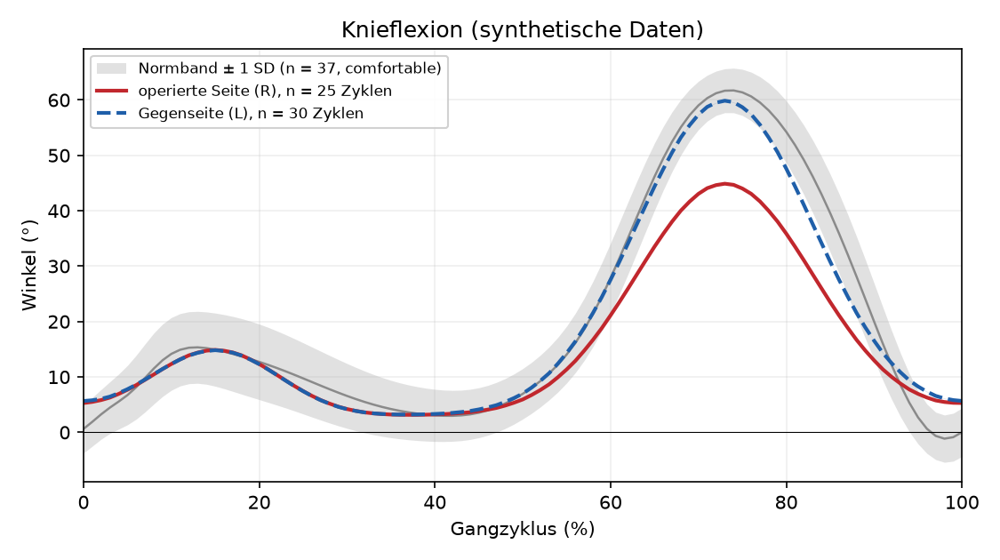
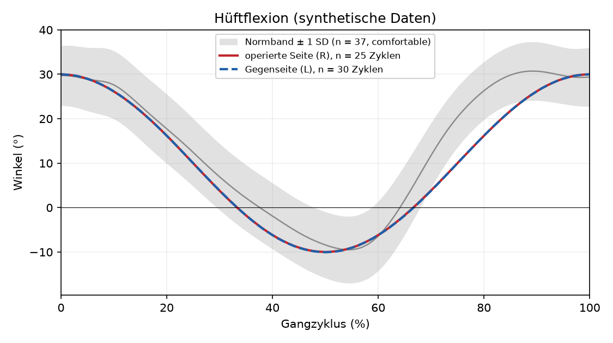

<!-- Automatisch erzeugtes Beispiel aus tests/session/conftest.py (10 Durchgaenge, synthetische Daten, keine echte Messung). Neu erzeugen: python scripts-frei, siehe tests/session/conftest.py::build_fake_session -->
# Ganganalyse Session 2026-09-05 19:30 (synthetische Daten)

Beobachtungen aus einem Handy-Video, seitliche Ansicht, ein Durchgang je Aufnahme. Dieses Dokument ist keine Aussage über Gesundheitszustand oder Vorgehen; es zeigt gemessene Zahlen mit ihrer Streuung und ihrer Messunsicherheit (Hypothese zur Besprechung mit Fachpersonal).

| Feld | Wert |
| --- | --- |
| Datum, Uhrzeit | 2026-09-05 19:30 |
| Wochen nach OP | 26 |
| Operierte Seite | R |
| Transplantat | STG (Hamstring) |
| Körperhöhe | 1,80 m |
| Ort | Flur Keller |
| Schuhe | Laufschuh X |
| Schmerz operiertes Knie (0-10) | 1 |
| Schmerz Gegenseite (0-10) | 0 |
| Müdigkeit (0-10) | 2 |
| Schlaf (h) | 7 |
| Aktivität am Vortag | Rad 40 min |
| Auswertung | camera_near, Normband-Klasse comfortable |
| Notizen | – |

Gepoolt wurden nur Zyklen der kameranahen Seite je Durchgang; die kamerafernen Gliedmaßen sind in der Seitenansicht teilweise verdeckt.

Normband-Klasse: aus Froude-Zahl Fr = 0,181 (v = 1,30 m/s, Beinlänge 0,95 m = 0,53 × Körperhöhe), Terzil-Grenzen 0,130 / 0,231.

## Mittelkurven gegen Normband

Durchgezogen: operierte Seite. Gestrichelt: Gegenseite. Grau: Normband ± 1 SD. Die farbigen Flächen sind ± 1 SD über die gepoolten Zyklen dieser Session.

## Zeit-Weg-Parameter und diskrete Winkelwerte

Mittelwert ± SD über alle gepoolten Zyklen der Session, n = Zyklen. SI nach Robinson 1987, positiv bedeutet: operierte Seite größer. Die Spalte MDC zeigt, ob der Betrag der Differenz über dem kleinsten messbaren Unterschied liegt; nur solche Zeilen sind für einen Vergleich belastbar (ADR-0003).

| Kennzahl | operierte Seite (R) | Gegenseite (L) | Differenz | SI (%) | MDC | Einordnung |
| --- | --- | --- | --- | --- | --- | --- |
| Standphase (%) | 59,1 ± 0,0 % (n = 25) | 59,1 ± 0,0 % (n = 30) | 0,0 | 0,0 | 5,0 % | unter MDC |
| Schwungphase (%) | 40,9 ± 0,0 % (n = 25) | 40,9 ± 0,0 % (n = 30) | -0,0 | -0,0 | 5,0 % | unter MDC |
| Doppelstütz (%) | 18,2 ± 0,0 % (n = 25) | 18,2 ± 0,0 % (n = 30) | -0,0 | -0,0 | 5,0 % | unter MDC |
| Stride-Zeit (s) | 1,10 ± 0,00 s (n = 25) | 1,10 ± 0,00 s (n = 30) | -0,00 | -0,0 | 0,05 s | unter MDC |
| Kadenz (Schritte/min) | 109,1 ± 0,0 Schritte/min (n = 25) | 109,1 ± 0,0 Schritte/min (n = 30) | 0,0 | 0,0 | – | kein MDC hinterlegt |
| Schrittlänge (m) | 0,72 ± 0,00 m (n = 25) | 0,72 ± 0,00 m (n = 25) | 0,00 | 0,0 | – | kein MDC hinterlegt |
| Stride-Länge (m) | 1,43 ± 0,00 m (n = 25) | 1,43 ± 0,00 m (n = 30) | -0,00 | -0,0 | – | kein MDC hinterlegt |
| Geschwindigkeit (m/s) | 1,30 ± 0,00 m/s (n = 25) | 1,30 ± 0,00 m/s (n = 30) | -0,00 | -0,0 | 0,10 m/s | unter MDC |
| Knieflexion bei Initialkontakt (°) | 5,3 ± 0,1 ° (n = 25) | 5,7 ± 0,1 ° (n = 30) | -0,4 | -6,9 | 7,5 ° | unter MDC |
| Peak Knieflexion Loading Response (0-30 %) (°) | 14,9 ± 0,1 ° (n = 25) | 14,8 ± 0,1 ° (n = 30) | 0,1 | 0,3 | 9,2 ° | unter MDC |
| Minimum Knieflexion mittlere Standphase (°) | 3,1 ± 0,1 ° (n = 25) | 3,2 ± 0,1 ° (n = 30) | -0,1 | -1,7 | 7,5 ° | unter MDC |
| Peak Knieflexion Schwung (°) | 44,9 ± 0,1 ° (n = 25) | 59,9 ± 0,1 ° (n = 30) | -15,0 | -28,6 | 9,2 ° | über MDC |
| Knie-ROM (°) | 41,7 ± 0,1 ° (n = 25) | 56,7 ± 0,1 ° (n = 30) | -14,9 | -30,3 | 7,5 ° | über MDC |
| Peak Hüftflexion (°) | 30,0 ± 0,1 ° (n = 25) | 30,0 ± 0,1 ° (n = 30) | -0,0 | -0,0 | 7,5 ° | unter MDC |
| Peak Hüftextension (Minimum) (°) | -10,0 ± 0,1 ° (n = 25) | -10,0 ± 0,1 ° (n = 30) | 0,0 | 0,5 | 7,5 ° | unter MDC |

Gangasymmetrie nach Plotnik (Schwungzeiten, immer ≥ 0): 0,0 % (Yogev/Plotnik et al. 2007, *Exp Brain Res* 177:336-346).

## Beobachtungen

Jeder Satz nennt beide Seiten mit Streuung, die Differenz und den kleinsten messbaren Unterschied (MDC) mit Quelle. Liegt die Differenz unter dem MDC, ist sie von der Messunsicherheit nicht zu trennen.

- Peak Knieflexion Loading Response (0-30 %), operierte Seite: 14,9 ± 0,1 °, Gegenseite: 14,8 ± 0,1 °, Differenz 0,1 ° liegt unter dem MDC von 9,2 ° (Gait & Posture 2017, PMID 28288331 (ICC 0.86, marker-based lab)).
- Peak Knieflexion Schwung, operierte Seite: 44,9 ± 0,1 °, Gegenseite: 59,9 ± 0,1 °, Differenz 15,0 ° liegt über dem MDC von 9,2 ° (Gait & Posture 2017, PMID 28288331 (ICC 0.86, marker-based lab)).
- Minimum Knieflexion mittlere Standphase, operierte Seite: 3,1 ± 0,1 °, Gegenseite: 3,2 ± 0,1 °, Differenz 0,1 ° liegt unter dem MDC von 7,5 ° (pooled reliability studies, MDC range 3.8-11.5 deg (see docs/research/02)).
- Knie-ROM, operierte Seite: 41,7 ± 0,1 °, Gegenseite: 56,7 ± 0,1 °, Differenz 14,9 ° liegt über dem MDC von 7,5 ° (pooled reliability studies, MDC range 3.8-11.5 deg (see docs/research/02)).
- Peak Hüftflexion, operierte Seite: 30,0 ± 0,1 °, Gegenseite: 30,0 ± 0,1 °, Differenz 0,0 ° liegt unter dem MDC von 7,5 ° (pooled reliability studies, MDC range 3.8-11.5 deg (see docs/research/02)).
- Peak Hüftextension (Minimum), operierte Seite: -10,0 ± 0,1 °, Gegenseite: -10,0 ± 0,1 °, Differenz 0,0 ° liegt unter dem MDC von 7,5 ° (pooled reliability studies, MDC range 3.8-11.5 deg (see docs/research/02)).
- Standphase, operierte Seite: 59,1 ± 0,0 %, Gegenseite: 59,1 ± 0,0 %, Differenz 0,0 % liegt unter dem MDC von 5,0 % (conservative assumption, no published video-based value, Platzhalterwert bis zur eigenen Wiederholungsmessung).
- Doppelstütz, operierte Seite: 18,2 ± 0,0 %, Gegenseite: 18,2 ± 0,0 %, Differenz 0,0 % liegt unter dem MDC von 5,0 % (conservative assumption, no published video-based value, Platzhalterwert bis zur eigenen Wiederholungsmessung).
- Geschwindigkeit, operierte Seite: 1,30 ± 0,00 m/s, Gegenseite: 1,30 ± 0,00 m/s, Differenz 0,00 m/s liegt unter dem MDC von 0,10 m/s (conservative assumption, no published video-based value, Platzhalterwert bis zur eigenen Wiederholungsmessung).

Hypothese zur Besprechung mit Fachpersonal: Zeilen mit „über MDC“ sind die einzigen, die eine Nachfrage wert sind; alles darunter liegt im Rauschen dieser Messmethode.

## Abstand zum Normband

Gait Variable Score (GVS) ist der RMS-Abstand der Mittelkurve zur Normband-Mittelkurve, Gait Profile Score (GPS) der RMS über die Kanäle (Baker et al. 2009, *Gait & Posture* 30(3):265-269). Bei gesunden Erwachsenen liegt der GPS bei etwa 5 bis 6°. Die Normbänder stammen aus Laborsystemen mit Markern, die Videomessung misst anders; der Abstand enthält also auch einen Methodenanteil.

| Kanal | GVS Gegenseite (L) | GVS operierte Seite (R) | außerhalb ± 2 SD (L) | außerhalb ± 2 SD (R) |
| --- | --- | --- | --- | --- |
| Hüftflexion | 4,7° | 4,7° | 0 % | 0 % |
| Knieflexion | 3,4° | 8,6° | 0 % | 22 % |
| **GPS** | **4,1°** | **6,9°** | – | – |

Normband-Quellen:
- `hip_flexion_deg@comfortable`: Fukuchi CA, Fukuchi RK, Duarte M (2018). A public data set of overground and treadmill walking kinematics and kinetics of healthy individuals. PeerJ 6:e4640.
- `knee_flexion_deg@comfortable`: Fukuchi CA, Fukuchi RK, Duarte M (2018). A public data set of overground and treadmill walking kinematics and kinetics of healthy individuals. PeerJ 6:e4640.

## Was dieses Video nicht sieht

Ein einzelnes Video aus der Seitenansicht misst Winkel, Zeiten und Wege.
Drei Dinge, die für den Verlauf nach einer Kreuzbandplastik wichtig sind, bleiben dabei außerhalb
der Messung:

- **Gelenkmomente und Kräfte.** Das äußere Knieflexionsmoment ist nach ACLR über Jahre
  verändert (Peak Knieextensormoment beim Gehen 0,04 ± 0,2 gegenüber 0,23 ± 0,1 Nm/kg·m bei
  Kontrollpersonen, p < 0,001, fünf Jahre nach der Operation), ohne dass sich die Winkelkurve
  entsprechend deutlich unterscheidet (Noehren, Wilson, Miller, Lattermann 2013, *Med Sci Sports
  Exerc* 45(7):1340-1347; Sajedi et al. 2025, *Healthcare* 13(24):3304). Momente brauchen eine
  Kraftmessplatte, kein Video kann sie ersetzen.
- **Muskelaktivierung.** Wie stark und wann Quadrizeps und ischiocrurale Muskulatur aktiv sind,
  ist aus der Körperkontur nicht ablesbar. Genau dort liegt aber ein großer Teil dessen, was sich
  nach einer Kreuzbandplastik anders anfühlt (Oberflächen-EMG wäre die passende Messgröße,
  siehe ADR-0005).
- **Die Gegenseite als Referenz.** Der Seitenvergleich unterstellt, dass die nicht operierte
  Seite unverändert ist. Nach ACLR verändert sie sich mit, deshalb kann ein Symmetriewert nahe
  null die Situation günstiger erscheinen lassen, als sie ist (Wellsandt, Failla,
  Snyder-Mackler 2017, *JOSPT*, DOI 10.2519/jospt.2017.7285).

Alle Angaben in diesem Dokument sind Beobachtungen aus der Videomessung und Hypothesen zur
Besprechung mit Fachpersonal, keine Aussage über Gesundheitszustand oder Vorgehen.

## Qualität

- Durchgänge: 10 von 10 ausgewertet.
- Zyklen Seite L (Gegenseite): 30 gepoolt, 0 als Ausreißer verworfen, fehlende Samples im Mittel 0,0 %.
- Zyklen Seite R (operierte Seite): 25 gepoolt, 0 als Ausreißer verworfen, fehlende Samples im Mittel 0,0 %.
- Bildrate der ausgewerteten Videos: 60,0 fps.
- Im meta.yaml notierte Bildrate Kamera A: 60 fps.
- Kamera B: 10 Durchgänge vorhanden, in dieser Auswertung nicht verarbeitet.
- Zyklen je Durchgang, Seite L: A_pass02: 6, A_pass04: 6, A_pass06: 6, A_pass08: 6, A_pass10: 6.
- Zyklen je Durchgang, Seite R: A_pass01: 5, A_pass03: 5, A_pass05: 5, A_pass07: 5, A_pass09: 5.
- Hinweise aus der Verarbeitung:
  - 10 camera-B pass(es) found (B_pass01, B_pass02, B_pass03, B_pass04, B_pass05, B_pass06, B_pass07, B_pass08, B_pass09, B_pass10); this layer only processes camera A (sagittal). Camera B is kept for a later multi-camera backend.
  - kein Normband für Kanal/Kanäle: trunk_lean_deg

---

Erstellt von OpenACL am 2026-09-05T13:35:38+00:00 aus `<synthetische Session, tmp>`. Rohzahlen: `session.json`.
