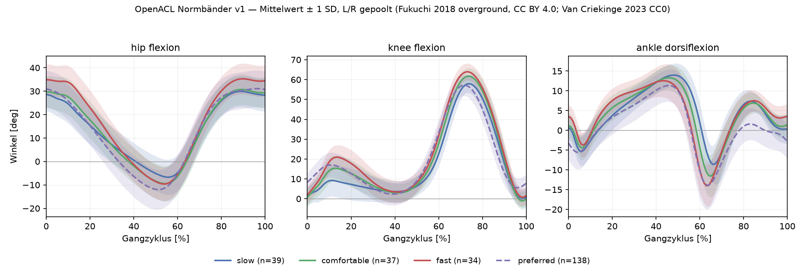

# `openacl.norm` – Normdaten und Normbänder

Diese Schicht liefert die **erste** der drei Referenzen aus ADR-0003: das
geschwindigkeitsnormierte Normband gesunder Erwachsener. Sie lädt öffentliche
Referenzdatensätze, bringt sie auf die kanonischen Kanalnamen und Vorzeichen aus
`openacl/schema.py` und leitet daraus kleine, versionierte Bänder ab.

Rohdaten bleiben lokal in `data/norm/` (gitignored), nur die abgeleiteten Bänder liegen im
Repo (ADR-0008).



## Benutzung

```python
from openacl.norm import load_normbands

bands = load_normbands()  # Winkelkurven, Fukuchi 2018
knee = bands["knee_flexion_deg@comfortable"]  # NormBand(mean, sd, n, source)
knee.mean.shape  # (101,) über 0–100 % Gangzyklus

scalars = load_normbands(kind="scalar")  # Zeit-Weg-Parameter
scalars["stance_pct@comfortable"].mean[0]  # 60.3 %
```

`NormBand` kommt aus `openacl.core.normband`, damit Gait-Core und Norm-Schicht denselben Typ
teilen. Schlüsselformat: `"<kanal>@<geschwindigkeitsklasse>"`.

Neu bauen (end-to-end reproduzierbar):

```bash
python scripts/download_normdata.py --list              # Größen und Lizenzen anzeigen
python scripts/download_normdata.py --dataset fukuchi2018
python scripts/download_normdata.py --dataset vancriekinge2023
python scripts/build_normbands.py                       # schreibt Parquet + JSON + Plot
```

## Datensätze und Lizenzen

| Datensatz | n | Inhalt | Lizenz (geprüft über die figshare-API, 2026-09-05) | Rolle |
|---|---|---|---|---|
| **Fukuchi et al. 2018**, PeerJ 6:e4640, [10.6084/m9.figshare.5722711](https://doi.org/10.6084/m9.figshare.5722711) | 42 (24 jung, 18 älter) | Overground (langsam/komfortabel/schnell) und Laufband (8 Stufen), Marker-Kinematik + Kraftmessplatten, ASCII + C3D | **CC BY 4.0** | Primärquelle: geschwindigkeitsklassifizierte Winkelbänder und Zeit-Weg-Parameter |
| **Van Criekinge et al. 2023**, Sci Data 10:852, [10.6084/m9.figshare.c.6503791](https://doi.org/10.6084/m9.figshare.c.6503791) | 138 gesunde Erwachsene (21–86 J.) | Ganzkörper-Vicon (Plug-in-Gait), barfuß, Vorzugsgeschwindigkeit; hier nur der verarbeitete Excel-Export (Artikel 24192489) | **CC0 1.0** | Unabhängiger Quercheck bei Vorzugsgeschwindigkeit |
| **Schreiber & Moissenet 2019**, Sci Data 6:111, [10.6084/m9.figshare.7734767](https://doi.org/10.6084/m9.figshare.7734767) | 50 gesunde Erwachsene | 5 Geschwindigkeitsstufen, Ganzkörper-Kinematik, GRF, EMG, C3D | **CC BY 4.0** | Noch nicht eingebunden – Downloader kennt ihn, Loader fehlt |

Alle drei sind permissiv (CC BY 4.0 bzw. CC0) und dürfen daher als abgeleitete Bänder in ein
öffentliches Apache-2.0-Repo. **Bedingung CC BY 4.0:** Namensnennung. Sie steht in
`normbands_v1.json` (`datasets[].citation`), in jedem `NormBand.source` und ist damit in
jedem Report sichtbar. Der Downloader legt zusätzlich je Datensatz eine `LICENSE.txt` unter
`data/norm/<dataset>/` ab.

Nicht verwendet: die 6,2-GB-MAT-Datei und die C3D-Archive. Für Normbänder reichen die
verarbeiteten, zyklusnormierten Dateien; Gesamtdownload dadurch ~0,6 GB statt ~9 GB.

## Vorzeichen-Mapping

`openacl/schema.py` verlangt: **Knieflexion positiv, Hüftflexion positiv, Dorsalextension
positiv**, Seitensuffix `_L`/`_R`.

### Fukuchi 2018 (`fukuchi.py`)

Die ASCII-Dateien führen `<Seite><Gelenk>Angle<X|Y|Z>`. Die **Z-Komponente ist die sagittale**.
Numerisch verifiziert an `WBDS01walkOCang.txt`:

| Kanal | Fukuchi-Spalte | Faktor | Beleg |
|---|---|---|---|
| `hip_flexion_deg` | `RHipAngleZ` / `LHipAngleZ` | +1 | 36° bei Initial Contact, Minimum −0,7° bei 54 % (terminale Standphase) |
| `knee_flexion_deg` | `RKneeAngleZ` / `LKneeAngleZ` | +1 | ~0° bei IC, Maximum 67,6° bei 74 % (Schwungphase) |
| `ankle_dorsiflexion_deg` | `RAnkleAngleZ` / `LAnkleAngleZ` | +1 | Maximum +9° bei 41 % (Dorsalextension in der Standphase), Minimum −14,7° bei 65 % (Plantarflexion um Toe-off) |
| `pelvis_tilt_deg` | Mittel aus `RPelvisAngleZ`, `LPelvisAngleZ` | +1 | konstant +12 bis +16° (anteriore Neigung) |

Links und rechts haben dieselbe Polarität, **es wird nichts gespiegelt**. Die Faktoren stehen
trotzdem explizit in `fukuchi.SAGITTAL_COLUMNS`, damit eine spätere Release-Änderung an einer
Stelle korrigiert werden kann. `trunk_lean_deg` liefert Fukuchi nicht.

### Van Criekinge 2023 (`vancriekinge.py`)

Spalten `HipAngles`, `KneeAngles`, `AnkleAngles`, `PelvisAngles` (Plug-in-Gait, sagittal,
Grad), Faktor jeweils +1 – dieselbe klinische Konvention. 1001 Punkte werden linear auf 101
resampled.

## Verarbeitungsschritte

1. **Download** (`scripts/download_normdata.py`) – figshare-API liefert Dateiliste, Größe und
   Lizenz; Download idempotent (Größenvergleich), Entpacken nur der gebrauchten Muster
   (`*ang.txt`, `*grf.txt`).
2. **Winkel laden** (`fukuchi.load_angles`) – je Proband, Bedingung, Seite eine
   zyklusnormierte Kurve (101 Punkte) im Long-Format
   `dataset, subject_id, age_years, sex, height_m, mass_kg, leg_length_m, trial_id, speed_m_s,
   condition, side, channel, pct, value_deg`. Nur **Overground**; Laufband ist ladbar
   (`conditions=("treadmill",)`), fließt aber nicht in die ausgelieferten Bänder ein.
3. **Beinlänge** – `LegLength` aus `WBDSinfo.xlsx`, plausibilisiert gegen die Körpergröße
   (akzeptiert 40–62 % der Größe; die Datei enthält Ausreißer bis 1,91 m). Sonst Schätzung
   `L_leg = 0,53 · height`.
4. **Froude-Zahl** – `Fr = v² / (g · L_leg)`, g = 9,80665 m/s² (Hof 1996). Macht Personen
   unterschiedlicher Körpergröße bei *dynamisch ähnlicher* Geschwindigkeit vergleichbar.
5. **Geschwindigkeitsklassen** – **Terzile der Froude-Zahl** über alle 126 Referenzkurven
   (42 Probanden × 3 Bedingungen). Grenzen v1: `Fr < 0,1304` = langsam,
   `0,1304 ≤ Fr < 0,2306` = komfortabel, `Fr ≥ 0,2306` = schnell. Die Grenzen stehen in
   `normbands_v1.json`, eine neue Messung wird über ihre eigene Froude-Zahl eingeordnet.

   *Warum Terzile statt Regression über Froude?* Bei 42 Probanden müsste eine Regression an
   den Rändern extrapolieren; die Reststreuung, die die Interpretationsschicht ohnehin
   braucht (Abweichung relativ zum MDC), bleibt gleich; und drei diskrete Bänder sind das,
   was in einem Report gelesen wird. Die Klassengrenze ist gekapselt – ein Wechsel auf eine
   Regression ändert nichts an den Konsumenten, die nur `NormBand` sehen.

   Die Terzile decken sich zu 83 % mit dem Protokoll (langsam/komfortabel/schnell), weichen
   aber genau dort ab, wo die Körpergröße es verlangt:

   | | slow | comfortable | fast |
   |---|---|---|---|
   | Protokoll `OS` | 39 | 3 | 0 |
   | Protokoll `OC` | 3 | 31 | 8 |
   | Protokoll `OF` | 0 | 8 | 34 |

6. **Bänder** (`bands.build_angle_bands`) – je Kanal und Klasse, **L und R gepoolt**:
   `mean`, `sd`, `p5`, `p95` über je 101 Punkte, plus `n_subjects` und `n_curves`.
   Poolen der Seiten ist bei Gesunden vertretbar (sagittale Seitendifferenz liegt weit unter
   der Streuung zwischen Personen) und verdoppelt die Kurvenzahl.
7. **Zeit-Weg-Parameter** (`fukuchi.load_spatiotemporal`) – aus den Kraftmessplatten der
   Overground-Durchgänge. Je Durchgang wird die Vertikalkraft aller einem Fuß zugeordneten
   Platten (`FP_RightFoot`/`FP_LeftFoot` aus `WBDSinfo.xlsx`) summiert, sodass ein Fuß auf
   zwei Platten (`FP4_5`) eine einzige Standphase ergibt; Schwelle 30 N, Mindestkontakt
   0,15 s, Abtastrate 300 Hz. Ein Zyklus wird nur gewertet, wenn **beide**
   Doppelstützphasen tatsächlich aufgezeichnet sind, sonst würde der Doppelstütz zu klein.
   Mittelwerte werden über Probandenmittel gebildet, damit kein Proband mit vielen Zyklen
   dominiert.
8. **Plausibilitätsgates** (`scripts/build_normbands.py`) – Peak-Knieflexion Schwung
   55–70°, Standphase 56–64 %, Kadenz 90–135/min, Doppelstütz 12–30 %. Fällt einer durch,
   wird **nichts** gespeichert (Vorzeichen- oder Normierungsfehler).

## Ergebnis v1

Peakwerte des Mittelwerts, ±1 SD zwischen Probanden:

| Kanal / Parameter | langsam | komfortabel | schnell | Quercheck (Van Criekinge, Vorzugstempo) |
|---|---|---|---|---|
| Peak Knieflexion Schwung | 57,9° ± 4,5 (n=39) | 61,7° ± 4,0 (n=37) | 64,0° ± 4,2 (n=34) | 57,2° ± 5,4 (n=138) |
| Peak Hüftflexion | 29,9° ± 6,6 | 30,7° ± 6,6 | 35,3° ± 6,6 | 31,1° ± 7,9 |
| Peak Plantarflexion | −8,6° | −11,6° | −14,0° | −13,9° |
| Ganggeschwindigkeit | 0,94 ± 0,08 m/s | 1,24 ± 0,10 m/s | 1,50 ± 0,11 m/s | – |
| Standphase | 61,8 ± 0,9 % | 60,3 ± 1,1 % | 59,1 ± 1,2 % | – |
| Doppelstütz | 23,7 ± 1,8 % | 20,4 ± 1,9 % | 17,9 ± 1,9 % | – |
| Kadenz | 97,9 ± 6,5 /min | 114,7 ± 5,6 /min | 132,3 ± 8,3 /min | – |
| Schrittlänge | 0,57 ± 0,04 m | 0,65 ± 0,05 m | 0,68 ± 0,05 m | – |

Dateien: `data/normbands_v1.parquet` (66 kB, Long-Format) und `data/normbands_v1.json`
(Datensätze, Lizenzen, Froude-Grenzen, Verarbeitungsdatum, Skriptversion, n je Band).

## Bekannte Einschränkungen

- **Messverfahren.** Alle Referenzen sind **marker-basierte** optische Systeme.
  Handy-Video misst anders: Modellunterschiede, Weichteilartefakte und 2D-Projektion
  ergeben systematische Offsets in der Größenordnung mehrerer Grad. Der Vergleich der beiden
  Datensätze untereinander zeigt das Problem im Kleinen: 4,5° Unterschied in der
  Peak-Knieflexion zwischen Fukuchi (eigenes Modell) und Van Criekinge (Plug-in-Gait) bei
  vergleichbarer Geschwindigkeit. **Ein Normband ersetzt daher keine eigene Baseline**, und
  Flags gehören erst oberhalb des selbst bestimmten MDC (ADR-0003).
- **Nur sagittal.** Frontal- und Transversalebene sind aus 2D-Video ohnehin nicht belastbar
  und deshalb nicht enthalten. `trunk_lean_deg` fehlt in beiden Quellen.
- **Seiten gepoolt.** Die Bänder haben keine Seiteninformation; für den Seitenvergleich ist
  die Gegenseite zuständig, nicht das Normband.
- **Alter.** Fukuchi mischt junge (24) und ältere (18) Probanden in einem Band; eine
  Altersschichtung fehlt in v1. Van Criekinge (21–86 J.) könnte sie liefern, dafür fehlen im
  öffentlichen Excel-Export aber Alter, Größe, Masse und Geschwindigkeit – die stehen nur im
  6,2-GB-MAT-File. Deshalb ist Van Criekinge in v1 nur Quercheck und trägt die eigene Klasse
  `preferred`.
- **n der Zeit-Weg-Parameter.** In der Klasse „schnell“ überleben nur 19 Probanden mit
  58 Zyklen die strenge Doppelstütz-Bedingung – bei schnellem Gehen trifft ein Durchgang
  seltener genug Platten. SD ist dort weniger gut geschätzt.
- **Kein `.gitignore`-Eintrag.** Die Regel `data/` in der Repo-`.gitignore` greift auch auf
  `src/openacl/norm/data/`. Damit die abgeleiteten Bänder wie in ADR-0008 vorgesehen im
  öffentlichen Repo landen, braucht es dort eine Zeile:
  `!src/openacl/norm/data/`.
- **Schreiber & Moissenet 2019** ist lizenzgeprüft (CC BY 4.0) und im Downloader hinterlegt,
  hat aber noch keinen Loader; die Daten liegen als C3D vor und brauchen `ezc3d`.
